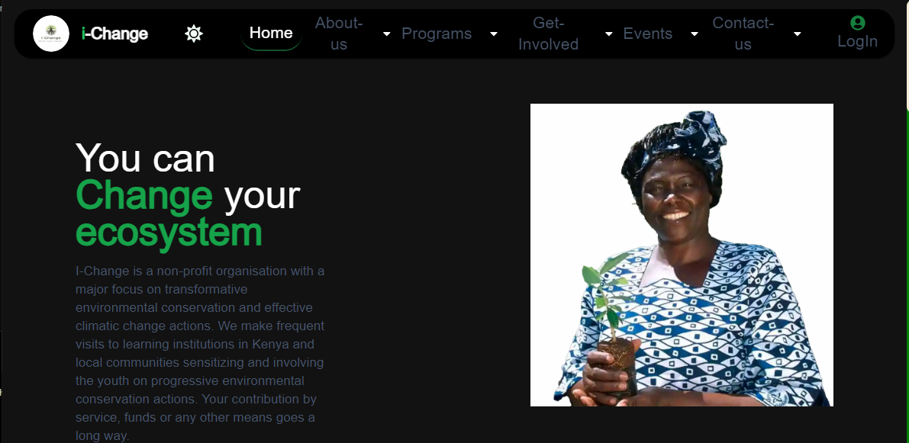

# I-Change
## website link
#### [IChange](https://www.i-change.vercel.app)
## Technology used  
1. Nextjs 
2. React 
3. Typescript 
4. Tailwind css 
5. postgreSQL || vercel/postgres 
6. zod 
7. vercel 
## description
   > I-Change is a non-profit organization dealing with environmental conservation and preservation. The activities involve but are not limited to planting trees, mentoring students as well as sensitizing the society at large about the best way to preserve our ecosystem
## sneak peek
   -
   - 
   - 

  
